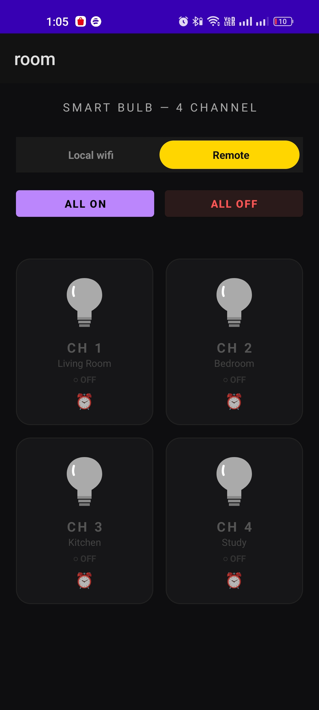
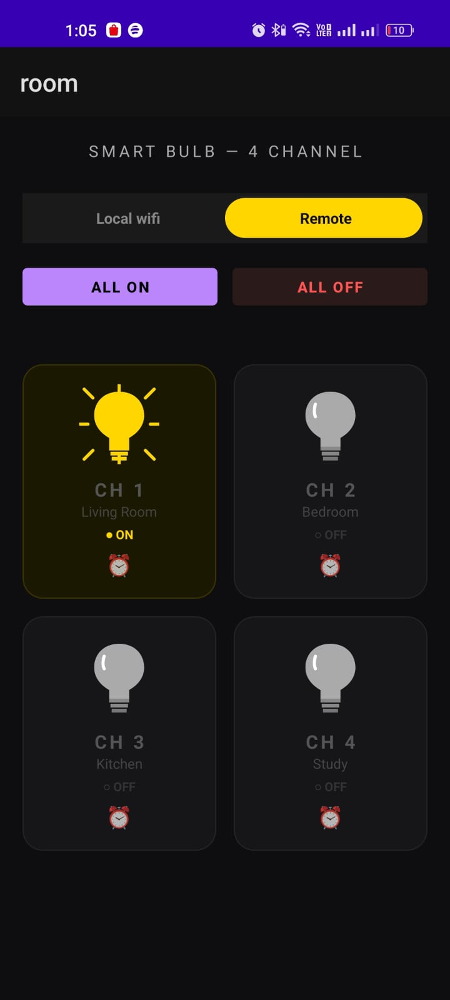

# 💡 SmartBulb — IoT Remote Bulb Control

> Control your home appliances from **anywhere in the world** using your Android phone.  
> Built with **ESP32 + 4-Channel Relay + Blynk IoT + Android Studio**


---

## 📱 Screenshots

| Bulb OFF | Bulb ON |
|----------|---------|
|  |  |

> Add your screenshots inside a `screenshots/` folder

---

## ✨ Features

- 💡 Control up to **4 relays** (bulbs/fans/devices) from anywhere
- 🌐 Works on **WiFi + Mobile Data** worldwide via Blynk Cloud
- 🔄 **Real-time state sync** — app shows current state on open
- 💾 **Last state saved** to flash — survives ESP32 power cuts
- 📶 **Auto WiFi reconnect** with watchdog every 10 seconds
- 🔧 **AP Provisioning mode** — configure WiFi & token without reflashing
- 🖥️ **Local HTTP server** — control via LAN even if Blynk is offline
- 🔘 **BOOT button** — hold 3 seconds to reset WiFi credentials
- 🔵 **LED indicator** — solid ON = AP mode, OFF = normal connected mode
- 🔁 **Dual-core FreeRTOS** — Blynk runs on Core 0, server on Core 1

---

## 🛠️ Hardware Required

| Component | Quantity |
|-----------|----------|
| ESP32 DevKit V1 | 1 |
| 5V 1-Channel Relay Module | 1 (or 4-channel) |
| AC Bulb + Holder | 1–4 |
| 5V Power Supply (500 mA min) | 1 |
| Jumper Wires | Few |

---

## 🔌 Wiring Diagram

```
ESP32 DevKit V1          Relay Module
─────────────────        ─────────────────
GPIO 26  (CH1)  ───────► IN1
GPIO 27  (CH2)  ───────► IN2
GPIO 12  (CH3)  ───────► IN3
GPIO 14  (CH4)  ───────► IN4
GND             ───────► GND
VIN (5V)        ───────► VCC

Relay Module             AC Appliance
─────────────────        ─────────────────
COM             ───────► Live wire (L)
NO              ───────► Appliance input
```

> ⚠️ **Warning:** 230V AC is dangerous. Always switch OFF MCB before touching AC wires.

---

## 📂 Project Structure

```
SmartBulb/
│
├── esp32/
│   └── SmartBulb.ino          # ESP32 Arduino firmware
│
├── android/                   # Android Studio project
│   └── app/src/main/
│       ├── java/com/samadroid/smartbulb/
│       │   └── MainActivity.java
│       ├── res/
│       │   ├── layout/
│       │   │   └── activity_main.xml
│       │   └── drawable/
│       │       ├── bulb_on.xml
│       │       └── bulb_off.xml
│       └── AndroidManifest.xml
│
├── screenshots/               # App screenshots
└── README.md
```

---

## ☁️ Tech Stack

| Layer | Technology |
|-------|------------|
| Hardware | ESP32 DevKit V1 |
| Firmware | Arduino IDE + Blynk Library |
| Cloud | Blynk IoT (blynk.cloud) |
| Local Server | ESP32 WebServer (port 80) |
| Storage | ESP32 NVS Preferences (flash) |
| Mobile App | Android Studio — Java |
| HTTP Client | OkHttp3 |
| Communication | Blynk REST API + Local HTTP |

---

## 🚀 Setup Guide

### Step 1 — Blynk Setup

1. Create free account at [blynk.io](https://blynk.io)
2. **New Template** → Name: `SmartBulb`, Hardware: `ESP32`, Connection: `WiFi`
3. **Datastreams** → New Datastream → Virtual Pin for each relay:

| Virtual Pin | Name | Type | Min | Max |
|-------------|------|------|-----|-----|
| V0 | Relay 1 | Integer | 0 | 1 |
| V1 | Relay 2 | Integer | 0 | 1 |
| V2 | Relay 3 | Integer | 0 | 1 |
| V3 | Relay 4 | Integer | 0 | 1 |

4. **New Device** → From Template → SmartBulb
5. Copy your **Auth Token** from Device Info tab

---

### Step 2 — ESP32 Firmware

1. Install [Arduino IDE](https://www.arduino.cc/en/software)
2. Add ESP32 board: **Board Manager** → search `ESP32 by Espressif Systems` → Install
3. Install Blynk: **Library Manager** → search `Blynk` → Install
4. Open `esp32/SmartBulb.ino`
5. Fill in your Template ID at the top:

```cpp
#define BLYNK_TEMPLATE_ID   "TMPLxxxxxxxxx"   // from Blynk dashboard
#define BLYNK_TEMPLATE_NAME "SmartBulb"
```

6. Upload to ESP32
7. **First time provisioning** — ESP32 starts in AP mode automatically:
   - Connect phone to WiFi: `SmartBulb-Setup` (password: `12345678`)
   - Open browser → go to:
   ```
   http://192.168.4.1/setup?ssid=YourWiFi&pass=YourPassword&token=YourAuthToken
   ```
   - ESP32 restarts and connects to your WiFi ✅

---

### Step 3 — Android App

1. Open project in **Android Studio**
2. In `MainActivity.java` set your Auth Token:
```java
private static final String AUTH = "YourBlynkAuthTokenHere";
```
3. Connect your Android phone via USB → Enable **USB Debugging**
4. Click **Run** (`Shift+F10`)

---

## 🌐 Local HTTP API

When ESP32 and phone are on same WiFi, you can control directly:

| Endpoint | Method | Description |
|----------|--------|-------------|
| `/ping` | GET | Check device online |
| `/status` | GET | Get all relay states |
| `/relay?pin=1&value=1` | GET | Turn relay ON/OFF |
| `/setup?ssid=&pass=&token=` | GET | Configure credentials |
| `/reset` | GET | Factory reset |

**Example:**
```
http://192.168.1.x/relay?pin=1&value=1   → Relay 1 ON
http://192.168.1.x/relay?pin=1&value=0   → Relay 1 OFF
http://192.168.1.x/status                → {"s1":1,"s2":0,"s3":0,"s4":0,...}
```

---

## ⚙️ How It Works

```
Android App (anywhere in world)
       │
       │  Blynk REST API (HTTPS)
       ▼
  Blynk Cloud ──────────────────► ESP32 (Core 0 — Blynk task)
                                     │
                                     ├── GPIO 26 → Relay 1 → Bulb 1 💡
                                     ├── GPIO 27 → Relay 2 → Bulb 2 💡
                                     ├── GPIO 12 → Relay 3 → Bulb 3 💡
                                     └── GPIO 14 → Relay 4 → Bulb 4 💡

Android App (same WiFi)
       │
       │  Local HTTP (port 80)
       ▼
  ESP32 WebServer (Core 1)  ──────► Same relays (works offline too)
```

---

## 🔘 BOOT Button Behavior

| Action | Result |
|--------|--------|
| Hold 3 seconds | Clears WiFi credentials → enters AP mode |
| LED solid ON | AP / provisioning mode active |
| LED OFF | Normal mode — WiFi connected |

---

## 🔮 Future Plans

- [ ] Schedule timer (auto ON at sunset)
- [ ] Push notifications on relay state change
- [ ] Google Assistant / Alexa via Sinric Pro
- [ ] Energy usage tracking
- [ ] Multiple device support
- [ ] Dark/Light theme toggle in app

---

## 🐛 Troubleshooting

| Problem | Solution |
|---------|----------|
| HTTP error 400 | Check Auth Token — no spaces, all 32 chars |
| WiFi not connecting | Check SSID/password, 2.4GHz only (not 5GHz) |
| Relay not clicking | Check GPIO wiring, ensure 5V supply |
| App shows old state | Pull to refresh or restart app |
| Blynk offline | Local HTTP still works on same WiFi |
| Forgot WiFi creds | Hold BOOT button 3s → re-provision |

---

## 👨‍💻 Author

**Samadroid**  
🔗 [GitHub](https://github.com/samadroid)

---

## 📄 License

This project is licensed under the **MIT License** — free to use, modify, and distribute.

---

> ⭐ **Agar project helpful laga toh Star zaroor karo!**
